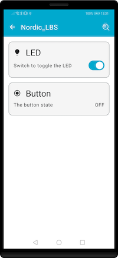

# test

# nRF Blinky for Android

nRF Blinky is an application targeting an audience of developers who are new to 
Bluetooth Low Energy. 

The app can be easily converted to work with other devices and may act as a template app.

This very simple application contains two basic features:
* turning on a LED on a connected Bluetooth LE device,
* receiving a Button press and release events from the device.

 

It demonstrates how the `BleManager` class from 
[Android BLE Library](https://github.com/NordicSemiconductor/Android-BLE-Library/) 
library can be used from a View Model 
(see [Architecture Components](https://developer.android.com/topic/libraries/architecture/index.html)).

## Structure

The new version of nRF Blinky application has been created in Jetpack Compose.

### Dependencies

It is using the following libraries:
* [Android BLE Library](https://github.com/NordicSemiconductor/Android-BLE-Library/) - handles Bluetooth LE connectivity
* [Nordic Common Library for Android](https://github.com/NordicPlayground/Android-Common-Libraries) - theme and common UI components, e.g. scanner screen
* [nRF Logger tree for Timber](https://github.com/NordicSemiconductor/nRF-Logger-API) - logs to nRF Logger app using [Timber](https://github.com/JakeWharton/timber)
* [Android Gradle Plugins](https://github.com/NordicSemiconductor/Android-Gradle-Plugins) - set of Gradle plugins

The gradle script was written in Kotlin Script (*gradle.kts*) and is using version catalog for 
dependency management.

### Modules

The application consists of the following modules:

* **:app** - the main module, contains the application code
* **:scanner** - contains the scanner screen destination
* **:blinky:spec** - contains the Blinky device specification, e.g. [`Blinky`](https://github.com/NordicSemiconductor/Android-nRF-Blinky/blob/b23b0252fe14bd0961c1edafa973f7da2768feb9/blinky/spec/src/main/java/no/nordicsemi/android/blinky/spec/Blinky.kt) API or the Service UUID
* **:blinky:ble** - contains the BLE related code, e.g. [`BlinkyManager`](https://github.com/NordicSemiconductor/Android-nRF-Blinky/blob/b23b0252fe14bd0961c1edafa973f7da2768feb9/blinky/ble/src/main/java/no/nordicsemi/android/blinky/ble/BlinkyManager.kt) implementation
* **:blinky:ui** - contains the UI related code, e.g. [`BlinkyScreen`](https://github.com/NordicSemiconductor/Android-nRF-Blinky/blob/b23b0252fe14bd0961c1edafa973f7da2768feb9/blinky/ui/src/main/java/no/nordicsemi/android/blinky/control/view/BlinkyScreen.kt)
  or [`BlinkyViewModel`](https://github.com/NordicSemiconductor/Android-nRF-Blinky/blob/b23b0252fe14bd0961c1edafa973f7da2768feb9/blinky/ui/src/main/java/no/nordicsemi/android/blinky/control/viewmodel/BlinkyViewModel.kt) implementation

The **:blinky:ui** and **:blinky:spec** modules are transport agnostic. The Bluetooth LE transport
is set using Hilt `@Binds` dependency injection [here](https://github.com/NordicSemiconductor/Android-nRF-Blinky/blob/b23b0252fe14bd0961c1edafa973f7da2768feb9/app/src/main/java/no/nordicsemi/android/blinky/di/BlinkyModule.kt#L59).

The app is based on **:navigation** module from the Nordic Common Library, which is using 
[`NavHost`](https://developer.android.com/jetpack/compose/navigation) under the hood, and adds 
type-safety to the navigation graph.

Each screen defines a `DestinationId` (with input and output types) and `NavigationDestination`, 
which declares the composable, inner navigation or a dialog target. See [`BlinkyDestination`](https://github.com/NordicSemiconductor/Android-nRF-Blinky/blob/b23b0252fe14bd0961c1edafa973f7da2768feb9/blinky/ui/src/main/java/no/nordicsemi/android/blinky/control/BlinkyDestination.kt) for an example.

Navigation between destinations is done using [`Navigator`](https://github.com/NordicPlayground/Android-Common-Libraries/blob/d8e60628a877eccf8592da4889cf12afdbc08e44/navigation/src/main/java/no/nordicsemi/android/common/navigation/Navigator.kt) object, 
available using Hilt form a `ViewModel`. When a new destination is selected, the input parameters 
are available from `SavedStateHandle` (see [`BlinkyModule`](https://github.com/NordicSemiconductor/Android-nRF-Blinky/blob/b23b0252fe14bd0961c1edafa973f7da2768feb9/app/src/main/java/no/nordicsemi/android/blinky/di/BlinkyModule.kt) class).

## Nordic LED and Button Service (LBS)

Service UUID: `00001523-1212-EFDE-1523-785FEABCD123`

A simplified proprietary service by Nordic Semiconductor, containing two characteristics:

- LED state (On/Off).
  - UUID: **`00001525-1212-EFDE-1523-785FEABCD123`**
  - Properties: **Write** or **Write Without Response**
    - Value: **`0x01`** => LED On
    - Value: **`0x00`** => LED Off

- Button state (Pressed/Released).
  - UUID: **`00001524-1212-EFDE-1523-785FEABCD123`**
  - Properties: **Notify**
    - Value: **`0x01`** => Button Pressed
    - Value: **`0x00`** => Button Released
  
For documentation for nRF5 SDK, check out 
[this link](https://infocenter.nordicsemi.com/topic/sdk_nrf5_v17.1.0/ble_sdk_app_blinky.html?cp=8_1_4_2_2_3)
and for one based on nRF Connect SDK 
[this link](https://developer.nordicsemi.com/nRF_Connect_SDK/doc/latest/nrf/samples/bluetooth/peripheral_lbs/README.html).

## Requirements

* This application depends on [Android BLE Library](https://github.com/NordicSemiconductor/Android-BLE-Library/).
* Android 4.3 or newer is required.
* Any nRF5 DK or another device is required in order to test the BLE Blinky service. The service 
  can also be emulated using nRF Connect for Android, iOS or Desktop.

## Installation and usage

Program your device with LED Button sample from nRF5 SDK (blinky sample) or nRF Connect SDK (LBS sample).

The device should appear on the scanner screen after granting required permissions.

### Required permissions

On Android 6 - 11 nRF Blinky will ask for Location Permission and Location services. 
This permission is required on Android in order to obtain Bluetooth LE scan results. The app does not
use location in any way and has no Internet permission so can be used safely.

This permission is not required from Android 12 onwards, where new 
[Bluetooth permissions](https://developer.android.com/guide/topics/connectivity/bluetooth/permissions)
were introduced. The `BLUETOOTH_SCAN` permission can now be requested with 
`usesPermissionFlags="neverForLocation"` parameter, which excludes location related data from the
scan results, making requesting location not needed anymore.